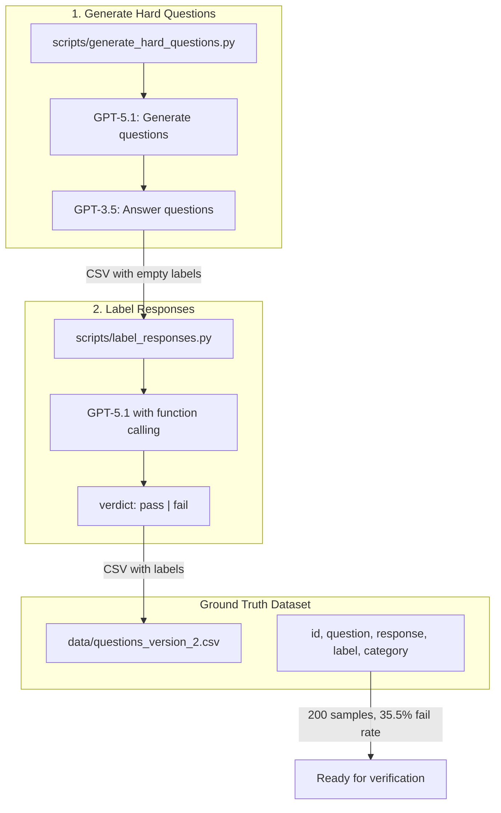
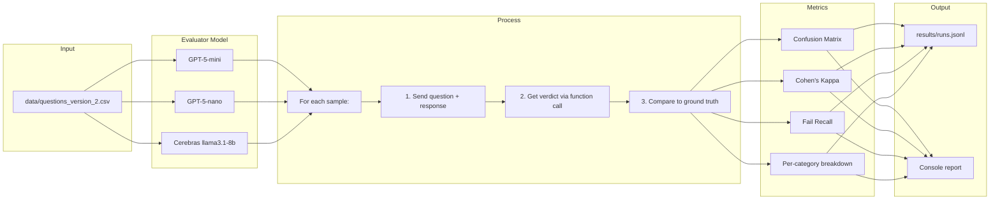
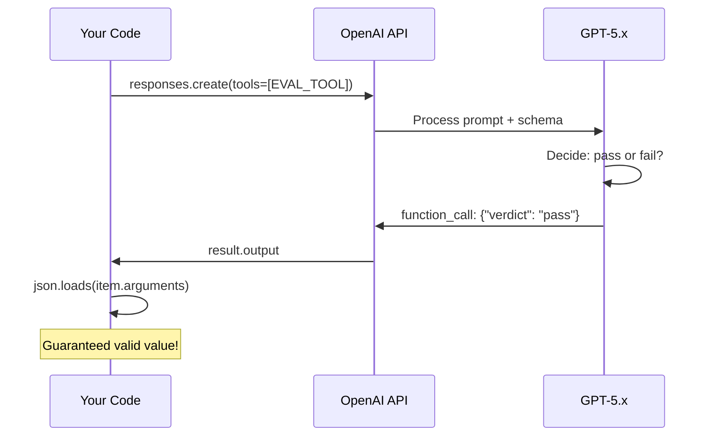
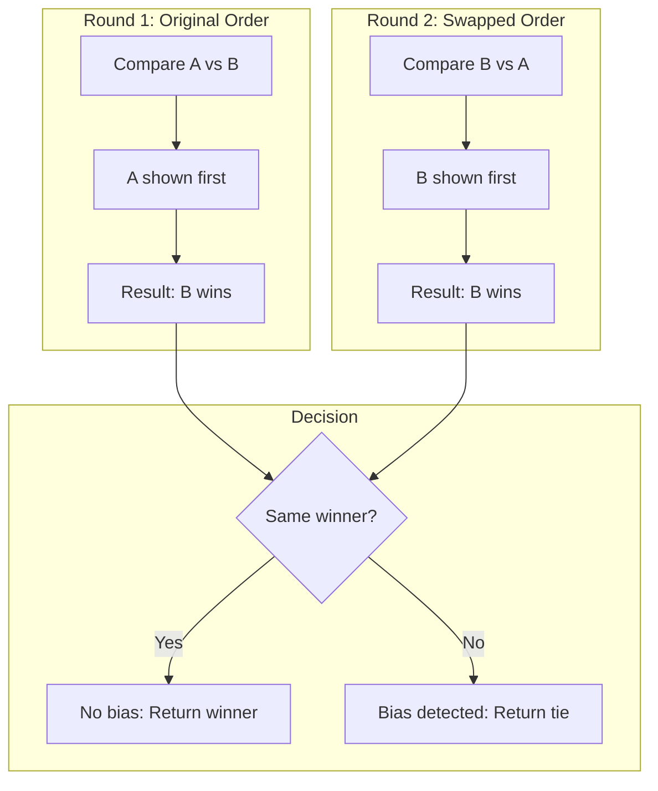

# Architecture

Visual overview of the LLM evaluation pipeline.

## System Overview

```
┌─────────────────────────────────────────────────────────────────────────┐
│                        LLM EVALUATION PIPELINE                          │
├─────────────────────────────────────────────────────────────────────────┤
│                                                                         │
│   ┌──────────────────────┐     ┌──────────────────────┐                │
│   │  1. GENERATE DATA    │     │  2. LABEL DATA       │                │
│   │                      │     │                      │                │
│   │  GPT-5.1 generates   │────▶│  GPT-5.1 labels      │                │
│   │  hard questions      │     │  pass/fail           │                │
│   │                      │     │  (ground truth)      │                │
│   │  GPT-3.5 answers     │     │                      │                │
│   │  (weak model =       │     │                      │                │
│   │   more failures)     │     │                      │                │
│   └──────────────────────┘     └──────────┬───────────┘                │
│                                           │                             │
│                                           ▼                             │
│                              ┌──────────────────────┐                   │
│                              │  data/questions.csv  │                   │
│                              │  (200 samples with   │                   │
│                              │   ground truth)      │                   │
│                              └──────────┬───────────┘                   │
│                                         │                               │
│                                         ▼                               │
│   ┌──────────────────────────────────────────────────────────────┐     │
│   │  3. VERIFY EVALUATOR                                         │     │
│   │                                                              │     │
│   │  ┌─────────────┐    ┌─────────────┐    ┌─────────────┐      │     │
│   │  │ GPT-5-mini  │    │ GPT-5-nano  │    │  Cerebras   │      │     │
│   │  │ (balanced)  │    │ (cheapest)  │    │ (alt)       │      │     │
│   │  └──────┬──────┘    └──────┬──────┘    └──────┬──────┘      │     │
│   │         │                  │                  │              │     │
│   │         └──────────────────┴──────────────────┘              │     │
│   │                            │                                 │     │
│   │                            ▼                                 │     │
│   │              Compare predictions vs ground truth             │     │
│   │              Calculate: Accuracy, Kappa, Fail Recall         │     │
│   └──────────────────────────────────────────────────────────────┘     │
│                                         │                               │
│                                         ▼                               │
│                              ┌──────────────────────┐                   │
│                              │  results/runs.jsonl  │                   │
│                              └──────────┬───────────┘                   │
│                                         │                               │
│                                         ▼                               │
│                              ┌──────────────────────┐                   │
│                              │  4. VISUALIZE        │                   │
│                              │  plot_runs.py        │                   │
│                              │  → docs/plots/*.png  │                   │
│                              └──────────────────────┘                   │
│                                                                         │
└─────────────────────────────────────────────────────────────────────────┘
```

## Data Generation Pipeline



## Verification Flow



## Function Calling Flow



## Position Bias Detection



## File Relationships

```
evals/
├── examples/                    # Start here! Simple examples
│   ├── minimal_eval.py         # 1 sample, 1 metric
│   ├── text_vs_function.py     # Why function calling matters
│   ├── kappa_calculator.py     # Understand metrics (no API)
│   └── position_bias_demo.py   # Detect order effects
│
├── eval_demo_*.py              # Three implementations compared
│   ├── eval_demo_gemini.py     # Free tier, text parsing
│   ├── eval_demo_gpt4.py       # Chat Completions, text parsing
│   └── eval_demo_gpt5.py       # Responses API, function calling ✓
│
├── verify_evaluator.py         # Full verification pipeline
│
├── scripts/                    # Data generation
│   ├── generate_hard_questions.py  # Create challenging questions
│   ├── label_responses.py          # Add ground truth labels
│   └── generate_answers.py         # Gemini answer generation
│
├── data/
│   └── questions_version_2.csv # 200 samples, 35.5% fail rate
│
├── results/
│   └── runs.jsonl              # Historical run logs
│
├── docs/
│   ├── plots/                  # Visualizations
│   ├── tutorial/               # Learning progression
│   ├── architecture.md         # This file
│   ├── glossary.md             # Key terms
│   ├── api_comparison.md       # API differences
│   └── common_mistakes.md      # Pitfalls to avoid
│
└── notebooks/                  # Interactive marimo notebooks
    ├── 01_understanding_evals.py
    ├── 02_position_bias.py
    └── 03_kappa_intuition.py
```

## Learning Path

```
Start Here
    │
    ▼
┌─────────────────────────────────────────────────────────────┐
│  1. CONCEPTS (30 min)                                       │
│     docs/glossary.md          - Key terminology             │
│     docs/tutorial/01_*.md     - Why evals matter            │
└──────────────────────────────────┬──────────────────────────┘
                                   │
                                   ▼
┌─────────────────────────────────────────────────────────────┐
│  2. EXAMPLES (1 hour)                                       │
│     examples/minimal_eval.py     - Simplest evaluation      │
│     examples/kappa_calculator.py - Metrics (no API)         │
│     examples/text_vs_function.py - Why function calling     │
└──────────────────────────────────┬──────────────────────────┘
                                   │
                                   ▼
┌─────────────────────────────────────────────────────────────┐
│  3. NOTEBOOKS (1 hour)                                      │
│     notebooks/01_*.py  - Interactive experiments            │
│     notebooks/02_*.py  - Position bias exploration          │
│     notebooks/03_*.py  - Kappa visualizations               │
└──────────────────────────────────┬──────────────────────────┘
                                   │
                                   ▼
┌─────────────────────────────────────────────────────────────┐
│  4. FULL PIPELINE (2 hours)                                 │
│     eval_demo_gpt5.py       - Production-quality demo       │
│     verify_evaluator.py     - Full verification             │
│     plot_runs.py            - Visualization                 │
└─────────────────────────────────────────────────────────────┘
```
